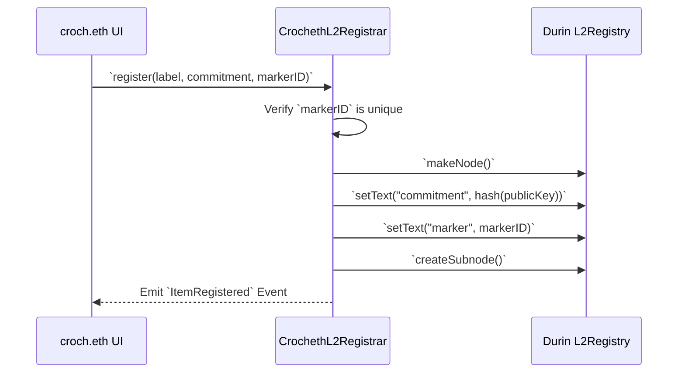

# ENS Integration

## Implementation Details
We leverage ENS to provide human-readable, recognizable identities for anonymous physical items while maintaining strict privacy. ENS clearly improves the product by making our anonymous agents identifiable (e.g. `midnight.croch.eth`) rather than just random 0x addresses, facilitating discovery without doxxing.

- **L2 Resolution (Base Sepolia)**: We utilize Durin's L2Registry to map `.croch.eth` subdomains entirely on Layer 2.
- **Privacy-Preserving Records**: Our custom registrar (`CrochethL2Registrar.sol`) acts as a uniqueness gatekeeper—enforcing that one physical ArUco marker maps to exactly one subdomain. Instead of saving the user's public key (HaLo address) on-chain, it saves a one-way hashed `commitment` as an ENS text record (`registry.setText("commitment", ...)`). 
- **Event-Driven Resolution**: The frontend resolves ownership directly from L2 Event Logs to avoid fragile manual queries, parsing the label and subnode to display the registered ENS handle seamlessly in the UI.

### Verification Flow

## Code References
- **`contracts/src/CrochethL2Registrar.sol`**: Contains the L2 Registrar logic, validation for marker IDs, and logic for setting ENS text records.
- **`app/src/components/ProfileCard.tsx`**: Queries the registrar to pull the associated subnode, resolves the label via `ItemRegistered` events, and constructs the user's ENS name (`label.croch.eth`).
