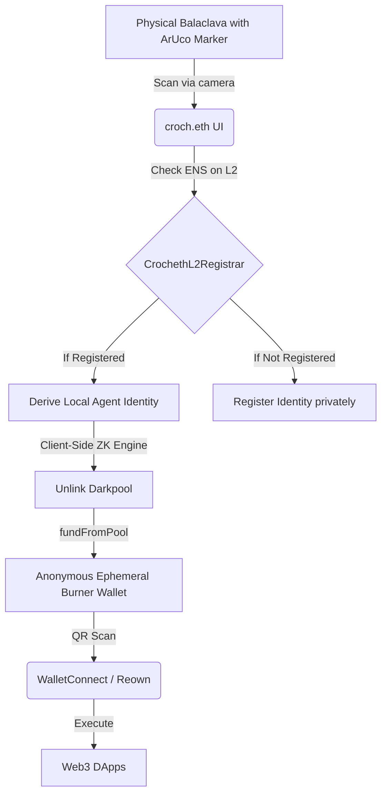

# croch.eth - Anonymous Wearable Identity

## Context & Problem
In the current Web3 landscape, linking physical objects to digital identities often requires doxxing the user's main wallet. We need a way to verify and utilize the identity of a physical wearable (like a balaclava) while preserving complete on-chain anonymity for the owner. 

## Solution
croch.eth is an air-gapped, privacy-preserving identity platform. We link physical crochet balaclavas, which have embedded ArUco fiducial markers for visual identification, to autonomous on-chain identities. The physical wearer's true EOA is never exposed. Instead, an anonymous burner wallet acts on their behalf, funded via Unlink's privacy pool, authenticated via a unique ENS subdomain, and connected to the broader ecosystem via WalletConnect.

## Architecture & Tech Details
- **Physical layer**: Balaclavas containing ArUco fiducial markers.
- **Privacy layer**: We leverage **Unlink** to anonymously fund burner wallets from a Darkpool, breaking the on-chain link between the owner's funding source and the agentic burner wallet.
- **Connectivity layer**: **WalletConnect / Reown** allows the burner wallet to scan connection QRs and safely push transactions to Web3 dApps without needing a standalone wallet extension.
- **Identity layer**: An L2 **ENS** Registrar on Base Sepolia (`CrochethL2Registrar.sol`) enforces a strict 1-to-1 mapping between a physical marker's ID and its `.croch.eth` subdomain. The true owner’s public key is never stored on-chain; only a one-way `commitment` hash is saved via ENS Text Records. 
- **Network**: Deployed on Base Sepolia testnet to utilize fast, cheap execution environments.

### Behind the Scenes: The Privacy Flow

1. **Physical Discovery**: A user scans their balaclava's ArUco marker using their phone. 
2. **ENS Verification**: The UI looks up the marker ID against our custom `CrochethL2Registrar.sol` to fetch the corresponding ENS subdomain without exposing the wearer's public identity.
3. **Private Funding via Unlink**: A local burner wallet is derived. We connect to Unlink's Darkpool directly from the client side, anonymously funding this derived agent. 
4. **Proxy Interaction**: This newly funded, ENS-named burner acts as an agentic wallet. Using WalletConnect, it can scan QR codes from arbitrary DApps, sign transactions, and perform on-chain actions while completely air-gapping the actions from the user's main wallet.
5. **Sweep**: Once finished, funds are swept securely back to the Darkpool.
