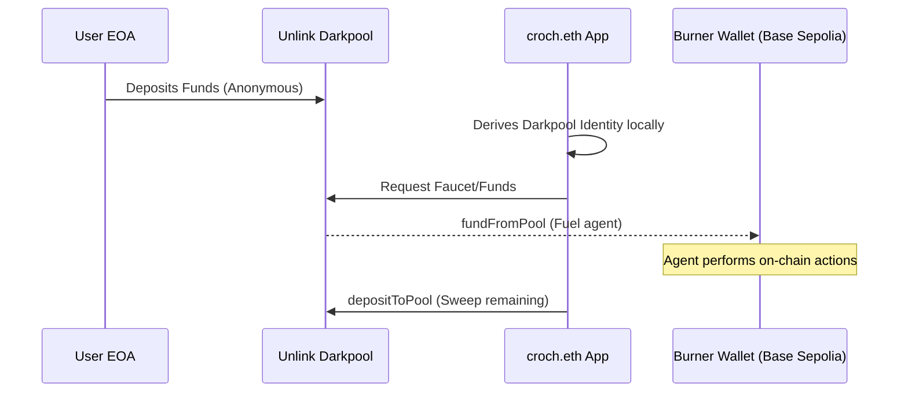

# Unlink Integration

## Implementation Details
Unlink is core to our privacy model. It solves the critical problem of how an anonymous balaclava burner wallet pays for gas without being reverse-traced to the user's primary EOA through transaction funding graphs. 

- **Darkpool Derivation**: We use the `@unlink-xyz/sdk` to construct a client-side Unlink ZK Engine instance. The user's secure darkpool account is derived and managed without ever exposing pool keys directly.
- **Private Funding**: In the dashboard, the SDK routes tokens (via `fundFromPool`) from the secure darkpool directly to the ephemeral burner wallet on Base Sepolia. This effectively breaks the on-chain link between the funding source and the agent's actions.
- **Sweeping**: Once the session is over, the `depositToPool` method is used to sweep any remaining funds from the burner wallet back into the privacy pool.

### Funding Flow

## Code References
- **`app/src/components/UnlinkDash.tsx`**: Contains the full lifecycle of the Unlink SDK integration, from client-side initialization, to Darkpool account fetching, burner wallet funding via `fundFromPool()`, and post-session sweeping via `depositToPool()`.
