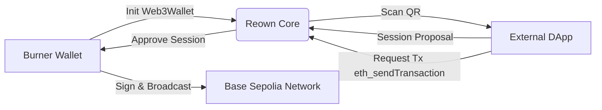

# WalletConnect / Reown Integration

## Implementation Details
We implement WalletConnect to allow our physical balaclava identities to natively interact with the broader ecosystem directly from the browser, acting as their own independent agents.

- **Web3Wallet SDK**: We initialize a `Web3Wallet` singleton instance connecting to the Reown Core SDK. This allows our interface to act as a fully functional wallet for the derived burner identity.
- **Session Lifecycle**: The active burner wallet natively processes `session_proposal` and `session_request` callbacks. It signs types of data like `personal_sign`, `eth_signTypedData_v4`, and fulfills `eth_sendTransaction` requests over the Base Sepolia network.
- **Physical QR Scanning**: We integrated `jsQR` and the native `BarcodeDetector` APIs to let users scan WalletConnect QR codes presented by external dApps directly using their device camera, pairing the anonymous identity on the fly. 

### Connection Flow

## Code References
- **`app/src/components/WCWallet.tsx`**: Contains the complete integration of `@walletconnect/web3wallet`, connection management logic, transaction authorization, and the camera QR scanning pipeline.
